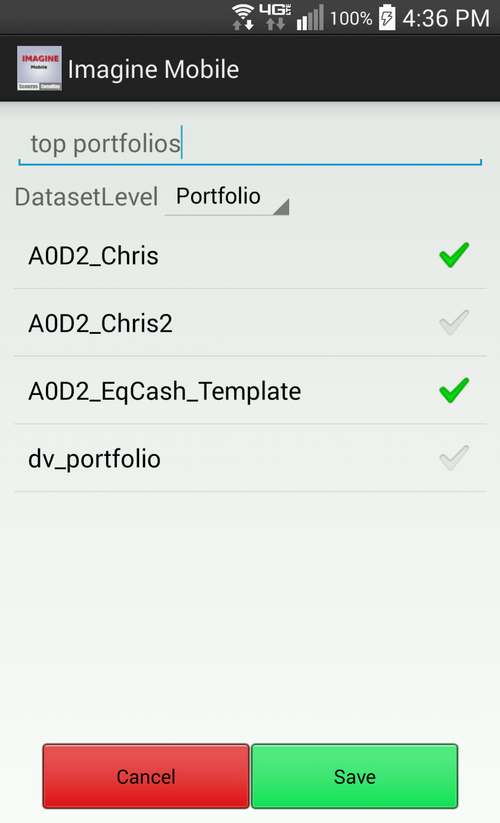
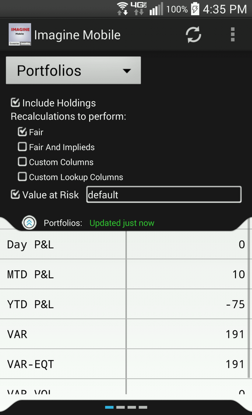
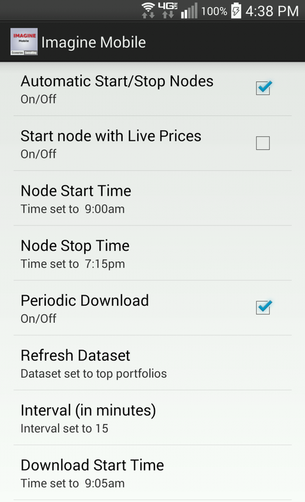
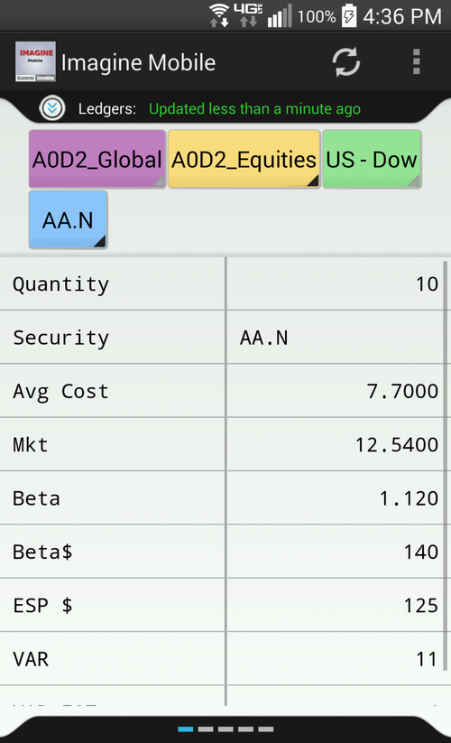

## Features and Benefits

- On the fly customization of any set of ledgers, books, and portfolios
- Easily turn on and off the various recalculations to perform, including VaR
- Control the level of detail, from summary views down to a detailed holdings view
- Refresh ledgers, books, and portfolios and view the most current data at the touch of a button
- Configure a schedule to automatically refresh and deliver the most current data to your device
- ImagineMobile remembers what was last viewed and allows you to view data from your last refresh at a glance

[ImagineMobile User Guide](https://s3.amazonaws.com/ImagineMobile/Imagine+Mobile+User+Guide.pdf)

Please view our [overview video](/mobilepromo/) outlining the features and benefits of ImagineMobile.

There are also videos that demonstrate how to [install](/mobileinstallation/), [configure](/mobileconfiguration/), and [navigate](/mobilenavigation/) ImagineMobile.

ImagineMobile Features

    

        
    

    
<strong>On the fly customization</strong> of any set of ledgers, books, and portfolios. Select custom groupings of your ledgers, books, and portfolios to keep current with those that are of most immediate interest.

-------

    

        
    

    
<strong>Recalulations</strong>, as well as holding detail level, are configurable at the time of refresh and persist for subsequent refreshes until your next change. this navigation drawer is the place to enter the VaR setup, types of recalculations, and determine if holdings detail is returned.

------

    

        
    

    
Set up <strong>unattended refresh schedules</strong>. Enter your daily schedule. Set up the start/stop times, intervals, and datasets to refresh. You'll then have a current snapshot of your positions, risk, and P&L at your fingertips.

------

    

        
    

    
The <strong>navigation bar </strong>, is one of the navigation aids to get you to where you want to be quickly. You can swipe left and swipe right to view other items at the same level, press on a color coded level to jump back up in the summary, or long press to pop up a quick pick dialog. Navigation is also aided by various visual indicators. For instance, greyed out down arrow indicates that there are no other items at that level, and the bottom page indicator shows you where in the order you are and if swiping is possible.

