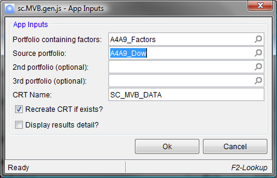

## MVB Integrator provides for easy integration of the output from the Multi-Factor Regression into your portfolio views.

With MVB Integrator you'll be able to:

- Easily create ad-hoc multivariate beta factor scenarios to keep current with market conditions
- Analyze the impact of including or removing beta factors on your real-time portfolio valuations
- Automate beta scenario integration to eliminate error prone manual extract processes

Our MVB Integrator app provides the following key features:

- Generate the results for up to 3 source books in one run

- Show beta weighted results in real time views

- Compare impact of additional factors in one portfolio view

For information on our pricing and our support policies, please visit our [pricing](/pricing) and our [support](/support) pages.

Once the MVB Integrator app is obtained form [Imagine's IFP Marketplace](http://marketplace.derivatives.com/collections/vendors?q=Scouras+Consulting), you can run the generator app (sc.MVB.gen.js) which is found in your 'MyApp' section of the App Explorer.

When you select sc.MVB.gen.js and press the **Run** button, the App Inputs screen will appear. This is where you will enter your factor portfolio and at least one portfolio which contains the source holdings you want to run the regression on. (If you have more than 3 portfolios, you can rerun for the additional portfolios, **but make sure to uncheck** the 'Recreate CRT if exists?' checkbox). The Custom Reference Table (CRT) name is defaulted to SC_MVB_DATA. This name is also the default that the Custom Columns app use, so don't change this unless you are setting up for a non-default portfolio view containing multiple factor portfolios.

After inputting your parameters, press the **Ok** button. The app will run the beta calculations (which may take some time, depending on number of factors and of number of source holdings). Upon completion, you will get a status screen similar to this:

If you checked the 'Display results detail?' checkbox, you'll see betas by source holding and factor for each portfolio selected. The app will also update the Custom Reference Table with the betas. At this point, you can integrate the results in your portfolio views with some basic look ups that you can set up like:

In addition to this basic setup, we provide custom column apps that give you more flexibility to display the factors. There are five custom column apps that enhance the functionality of the MVB Integrator app suite:

- SC_MVBFactorBeta - returns the beta for the holding. Parameters are factor name and an options CRT name which defaults to SC_MVB_DATA

- SC_MVBFactorCount - returns number of factors. Parameter is optional CRT name which defaults to SC_MVB_DATA

- SC_MVBFactorSeqName - returns name of factor denoted by number in factor sequence. Parameters are factor sequence and an optional CRT name which defaults to SC_MVB_DATA.

- SC_MCBFactorSeqBeta - returns beta of factor denoted by number in factor sequence. parameters are factor sequence and an optional CRT name which defaults to SC_MVB_DATA.

- SC_MVBFactorCalcDate - returns date that beta was last calculated for this holding. Parameter is optional CRT name which defaults to SC_MVB)_DATA

Here is an example of some of the apps used in custom columns for a portfolio view:

Here is a view of the Portfolio:

which used the output of the sc.MVB.gen.js app that created the CRT:

As reference, these are the input and results of the Imagine ITS Multi-factor Regression. This is the input:

and the results:

### MVB Support
There are many way to configure MVB Integrator. The best way to try out the functionality is:

  - Create a Portfolio with ONLY the factors. It should include .SPX, .DXY, CLc1 for the demonstration of functionality

  - Run this [install script](/mvbinstall/)

  - Run sc.MVB.gen.js and select a Portfolio, Book, or Ledger as the Source Holdings

  - Open a view to this source Portfolio, Book, or Ledger and add the custom columns