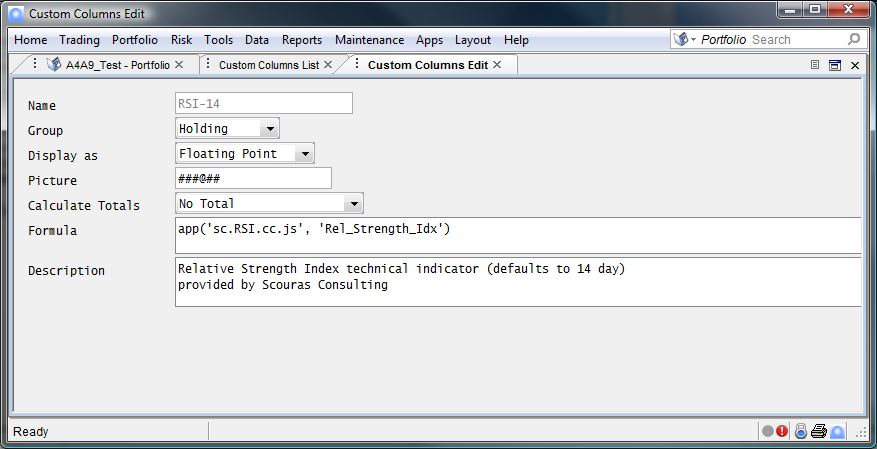
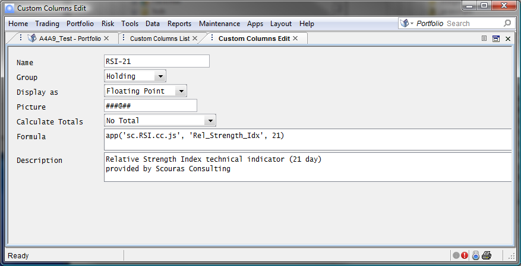

Relative Strength Index (RSI) is a momentum oscillator that measures the speed and change of price movements. RSI oscillates between zero and 100.

With RSI Custom, you'll be able to:

- Spot RSI trading signals specific to your holdings
- Integrate RSI indicator to your Imagine reports and extracts
- Eliminate time consuming, manual processes of gathering RSI from other sources

Our RSI Custom app provides the following key features:

- Generate Relative Strength Indicator of exchange traded instruments based on closing prices
- Configurable number of days

**Relative Strength Index (RSI)** - A momentum oscillator that measures the speed and change of price movements. RSI oscillates between zero and 100. Commonly, RSI is calculated over the 14 prior price changes but may be requested of more or fewer samples. By default, our Custom Column app looks at the prior 14 closes for the sampling, but the number of samples can be sent in as a parameter.

For information on our pricing and our support policies, please visit our [pricing](/pricing/) and [support](/support/) pages.

Once the RSI Custom app is obtained from [Imagine's IFP Marketplace](http://marketplace.derivatives.com/collections/vendors?q=Scouras+Consulting "Imagine's IFP Marketplace"), set up your Custom Columns as shown below. If you're using a 14 day RSI, there is no need for parameters:

If you would like a different number of days, simply set the number of days as a parameter, as in this 21 day RSI sample:

**RSI Support**

Please take a moment to watch this screen case which shows you how to set up and use the RSI functionality in Imagine.

    <video controls="controls" height="100%" width="80%">
        <source src="https://s3.amazonaws.com/ImagineMobile/RSICustom4-14-14.mp4">
        <source src="https://s3.amazonaws.com/ImagineMobile/RSICustom4-14-14.webm">
        <source src="https://s3.amazonaws.com/ImagineMobile/RSICustom4-14-14.flv">
    </video>

