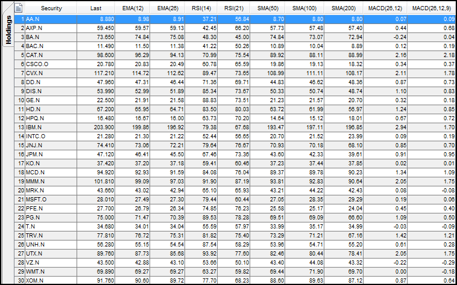
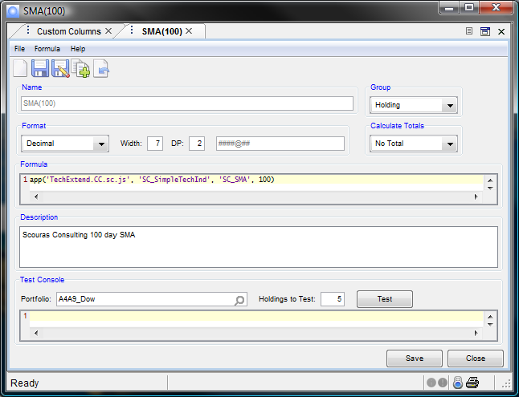
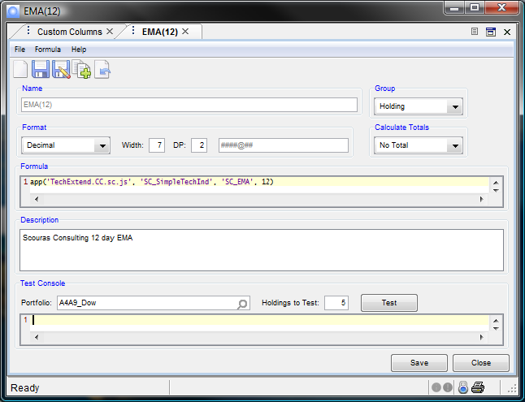
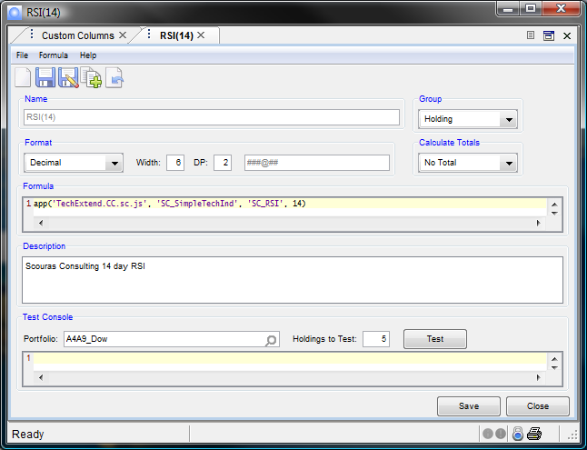
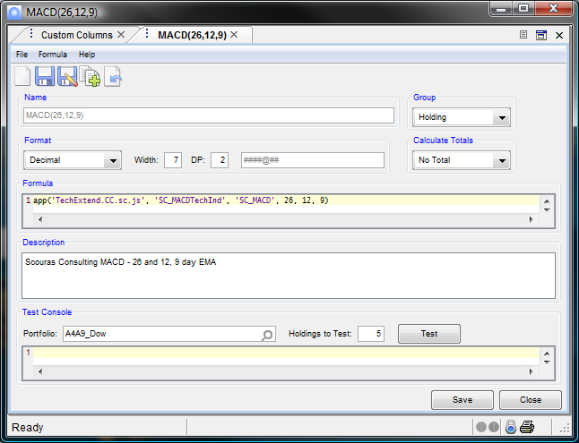

### TechExtend, integrate common Technical Analysis measures

The TechExtend app enables you to:

- Spot trading risks and opportunities in your portfolios
- Track when a holding's underlying price crosses a moving average
- Compare a technical indicator over different number of time periods

#### THE FOLLOWING TECHNICAL INDICATORS ARE AVAILABLE OVER A CONFIGURABLE NUMBER OF PERIODS:

- SMA - Simple Moving Average
- EMA - Exponential Moving Average
- RSI - Relative Strength Index
- MACD - Moving Average Convergence/Divergence

TechExtend is available at [Imagine's IFP app marketplace](http://marketplace.derivatives.com/collections/vendors?q=Scouras+Consulting)

The screen capture below is output form a portfolio setup utilizing the app. If a returned value is negative, please refer to the [TechExtend Error Codes](#techextend_support) section.

Once you have the app installed, simply [run this install](/teinstall/) script to install the common indicators. Alternatively, you can manually set up your Custom Columns as in the following examples:

- For Simple Moving Average:

- For Exponential Moving Average:

- For Relative Strength Index:

- For MACD Indicator:

<h3 id="techextend_support" >TechExtend Support</h4> 

#### TechExtend Parameters
Parameter | Values | Full Description
--- | --- | ---
First | TechExtend.CC.sc.js | Name of script
Second | SC_SimpleTechInd, or SC_MACDTechInd | SC_SimpleTechInd handles all indicator requsts except the MACD
Third | Indicator Type | SC_SMA, SC_EMA, SC_RSI for SimpleTechInd or SC_MACD for the MACDTechInd.
Remainder | Number of Days | 	Usually a single value. In the case of MACD, supply a list of 3 values (third being the number of days in the EMA of difference between first and second)

#### TechExtend Error Codes
Error # | Reason | Full Description
---  | --- | ---
-1.00 | Too few historic samples | Not enough of a history is available to figure an accurate value. For instance, 50 day simple moving average cannot be calculated with less than 50 historical values. Should only occur with new issues.
-2.00 | No closing history found for the Underlying Security | Error returned when Underlying Security is not exchange traded or the configured exchange is not supplying a 'CLOSE' value.
-3.00 | Invalid indicator name supplied to the formula | Set up error. Indicator must be supplied as: SC_SMA, SC_EMA, SC_RSI for Simple or SC_MACD for the MACD indicator. Should not occur if Custom Column definitions are installed with the [supplied install script](/teinstall/)
-10.00 | No TechExtend cache | Since newer versions of TechExtend always create the cache automatically, this error should not occur. If you receive this error, please [let us know](mailto:consulting@scouras.com)
-20.00 | Unexpected Error | If you receive this error, please [let us know](mailto:consulting@scouras.com)